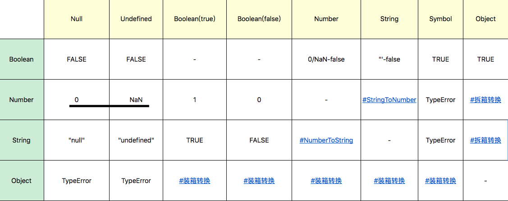

# JavaScript

## JS基础知识

1. 函数
2. 预编译、作用域、闭包
3. 原型、原型链、继承
4. 数组、对象的操作方法
5. ES6新特性
6. ES6面向对象
7. ES6异步编程

## 一、JS类型



## 二、JS对象

**数据属性**

+ value
+ writable
+ enumerable
+ configurable

**访问器属性**

+ getter
+ setter
+ enumerable
+ configurable

**API**

```js
const o = { get a() { return 1 } }
Object.defineProperty(o, "b", {value: 2, writable: false, enumerable: false, configurable: true})
const res1 = Object.getOwnPropertyDescriptor(o, 'a')
const res2 = Object.getOwnPropertyDescriptor(o, 'b')
console.log(res1, res2)
```

+ Object.defineProperty
+ Object.defineProperties
+ Object.getOwnPropertyDescriptor
+ Object.create
+ Object.assign
+ Object.entries (es2017)
+ Object.fromEntries (es2019)
+ Object.freeze
+ Object.seal
+ Object.preventExtensions

## 三、JS的原型系统

+ Object.create 根据指定的原型创建新对象，原型可以是 null
+ Object.getPrototypeOf 获得一个对象的原型
+ Object.setPrototypeOf 设置一个对象的原型

## 四、JS中的对象分类

+ 宿主对象
+ 内置对象 
  - 固有对象 [ecma](https://262.ecma-international.org/9.0/#sec-well-known-intrinsic-objects)
  - 原生对象
  - 普通对象

## 五、JS运行时


